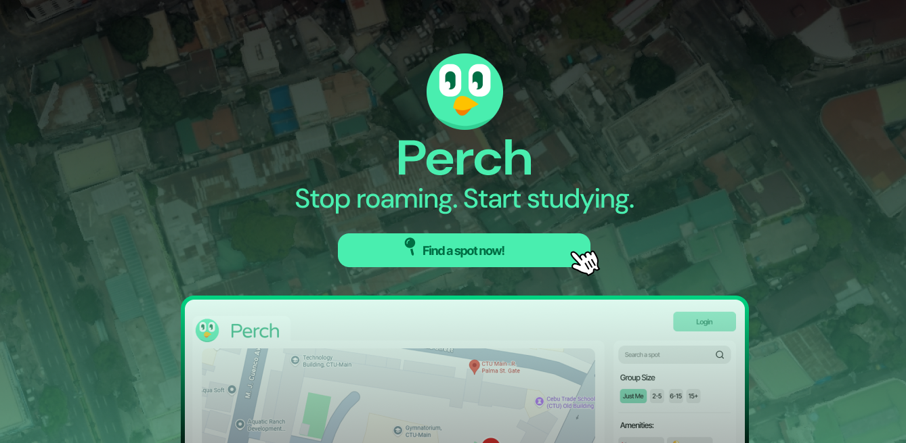

<p align="center">
  
</p>

<h1 align="center">Perch</h1>

<p align="center"><em>Stop roaming. Start studying.</em></p>

<p align="center">
  
  
  
  
  
</p>

---

Perch is a real-time, map-based web app that helps Filipino college students find available study spots the moment their professor moves class online. Open the link in your group chat, see what's free, claim your spot, and share it — no account needed.

## Stack

| | |
|---|---|
| Frontend | Vanilla JS (ES6 modules), HTML5, CSS3 |
| Build | Vite |
| Map | Google Maps JavaScript API |
| Backend | Supabase (PostgreSQL + Realtime) |

## Getting Started

```bash
# 1. Clone
git clone https://github.com/Nesqyk/perch.git && cd perch

# 2. Install
npm install

# 3. Configure
cp .env.example .env
# Fill in VITE_GOOGLE_MAPS_API_KEY, VITE_SUPABASE_URL, VITE_SUPABASE_ANON_KEY, VITE_ADMIN_PASSWORD

# 4. Run
npm run dev
```

Admin panel is available at `/admin`.

## Project Structure

<details>
<summary>Show file tree</summary>

```
src/
├── main.js               # Student app entry point
├── admin.js              # Admin panel entry point
├── core/
│   ├── events.js         # Pub/sub event bus
│   ├── store.js          # Central state + dispatch
│   └── router.js         # URL param read/write
├── map/
│   ├── mapLoader.js      # Google Maps SDK loader
│   ├── mapInit.js        # Map instance
│   ├── pins.js           # Marker CRUD + animations
│   └── mapControls.js    # Zoom + locate-me buttons
├── api/
│   ├── supabaseClient.js
│   ├── spots.js
│   ├── claims.js
│   ├── corrections.js
│   └── realtime.js
├── features/
│   ├── smartSuggestions.js   # F1 — ranked spot suggestions
│   ├── claim.js              # F2 — claim a spot
│   └── reportFull.js         # F3 — report a spot full
├── ui/
│   ├── filterPanel.js
│   ├── spotCard.js
│   ├── claimPanel.js
│   ├── reportPanel.js
│   ├── sidebar.js            # Desktop panel
│   ├── bottomSheet.js        # Mobile swipe sheet
│   ├── toast.js
│   └── modal.js
├── state/
│   └── spotState.js          # Derived spot status helpers
├── utils/
│   ├── session.js
│   ├── confidence.js
│   ├── capacity.js
│   └── time.js
└── styles/
    ├── main.css
    ├── map.css
    ├── sidebar.css
    ├── bottomSheet.css
    ├── spotCard.css
    ├── filters.css
    └── admin.css
```

</details>

## License

[MIT](./LICENSE) © 2026 Nesqyk
