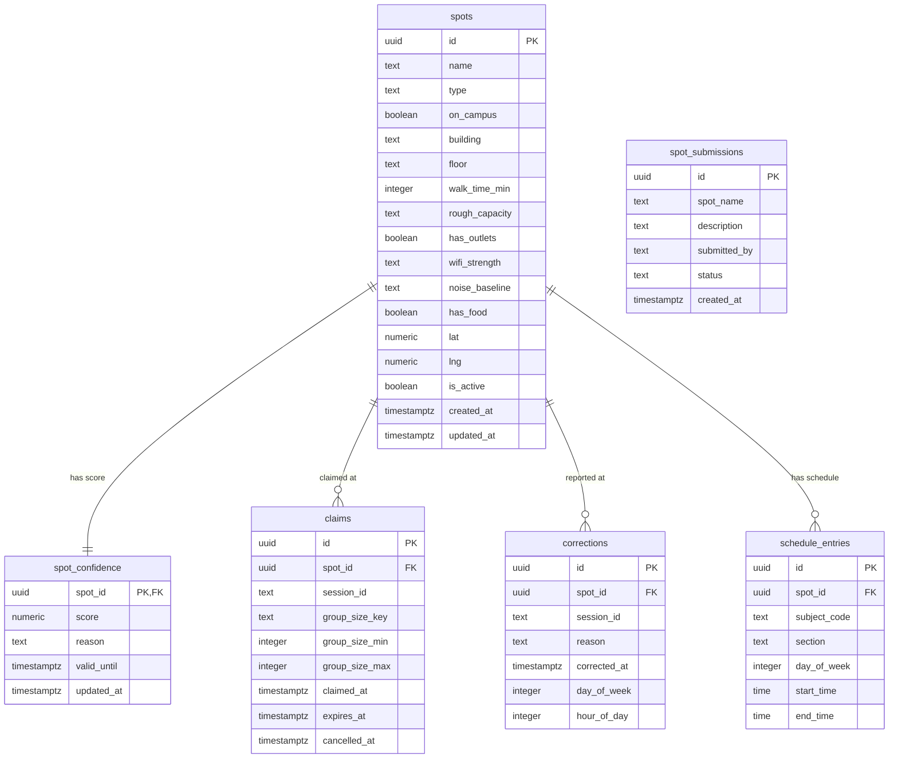

# Perch — Database Schema

## Notes

- `spot_confidence.spot_id` is both PK and FK — one row per spot, auto-seeded on `spots` INSERT via trigger.
- `claims.cancelled_at` nullable — null + future `expires_at` = active claim.
- `corrections` is append-only (no update columns) — the `refresh_spot_confidence()` fn aggregates them.
- `spot_submissions` has no FK to `spots` — independent until an admin promotes one.
- `rough_capacity`: `small` (~8) | `medium` (~20) | `large` (~40)
- `wifi_strength`: `none` | `weak` | `ok` | `strong`
- `noise_baseline`: `quiet` | `moderate` | `loud`
- `group_size_key`: `solo` | `small` | `medium` | `large`
- `corrections.reason`: `locked` | `occupied` | `overcrowded` | `event`
- `spot_submissions.status`: `pending` | `approved` | `rejected`
