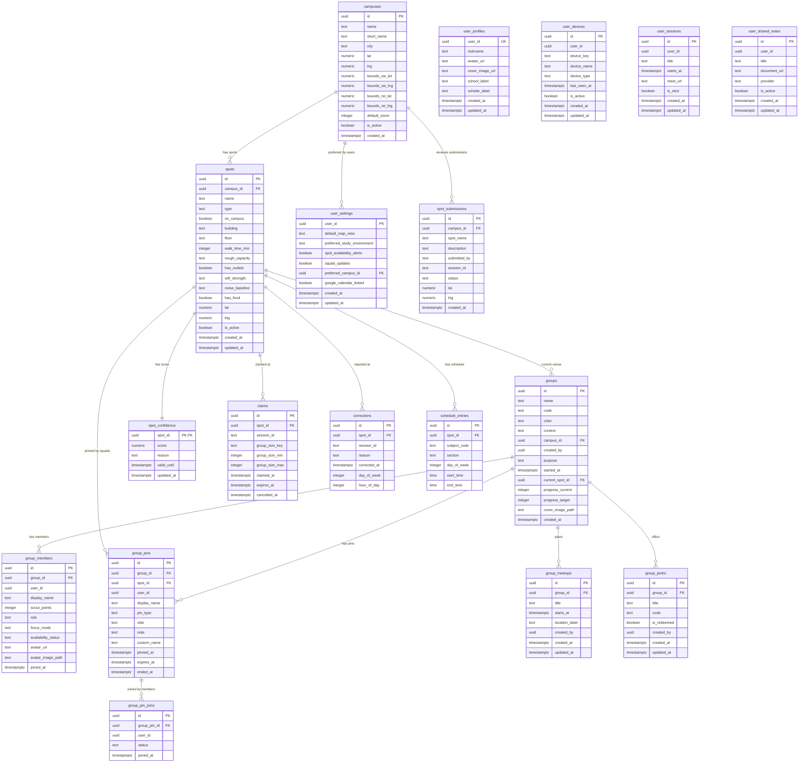

# Perch — Database Schema

```mermaid
erDiagram
    campuses {
        uuid id PK
        text name
        text short_name
        text city
        numeric lat
        numeric lng
        numeric bounds_sw_lat
        numeric bounds_sw_lng
        numeric bounds_ne_lat
        numeric bounds_ne_lng
        integer default_zoom
        boolean is_active
        timestamptz created_at
    }

    spots {
        uuid id PK
        uuid campus_id FK
        text name
        text type
        boolean on_campus
        text building
        text floor
        integer walk_time_min
        text rough_capacity
        boolean has_outlets
        text wifi_strength
        text noise_baseline
        boolean has_food
        numeric lat
        numeric lng
        boolean is_active
        timestamptz created_at
        timestamptz updated_at
    }

    groups {
        uuid id PK
        text name
        text code
        text color
        text context
        uuid campus_id FK
        uuid created_by
        text purpose
        timestamptz started_at
        uuid current_spot_id FK
        integer progress_current
        integer progress_target
        text cover_image_path
        timestamptz created_at
    }

    group_members {
        uuid id PK
        uuid group_id FK
        uuid user_id
        text display_name
        integer scout_points
        text role
        text focus_mode
        text availability_status
        text avatar_url
        text avatar_image_path
        timestamptz joined_at
    }

    group_pins {
        uuid id PK
        uuid group_id FK
        uuid spot_id FK
        uuid user_id
        text display_name
        text pin_type
        text vibe
        text note
        text custom_name
        timestamptz pinned_at
        timestamptz expires_at
        timestamptz ended_at
    }

    group_pin_joins {
        uuid id PK
        uuid group_pin_id FK
        uuid user_id
        text status
        timestamptz joined_at
    }

    group_meetups {
        uuid id PK
        uuid group_id FK
        text title
        timestamptz starts_at
        text location_label
        uuid created_by
        timestamptz created_at
        timestamptz updated_at
    }

    group_perks {
        uuid id PK
        uuid group_id FK
        text title
        text code
        boolean is_redeemed
        uuid created_by
        timestamptz created_at
        timestamptz updated_at
    }

    user_profiles {
        uuid user_id UK
        text nickname
        text avatar_url
        text cover_image_url
        text school_label
        text scholar_label
        timestamptz created_at
        timestamptz updated_at
    }

    user_settings {
        uuid user_id PK
        text default_map_view
        text preferred_study_environment
        boolean spot_availability_alerts
        boolean squad_updates
        uuid preferred_campus_id FK
        boolean google_calendar_linked
        timestamptz created_at
        timestamptz updated_at
    }

    user_devices {
        uuid id PK
        uuid user_id
        text device_key
        text device_name
        text device_type
        timestamptz last_seen_at
        boolean is_active
        timestamptz created_at
        timestamptz updated_at
    }

    user_sessions {
        uuid id PK
        uuid user_id
        text title
        timestamptz starts_at
        text meet_url
        boolean is_next
        timestamptz created_at
        timestamptz updated_at
    }

    user_shared_notes {
        uuid id PK
        uuid user_id
        text title
        text document_url
        text provider
        boolean is_active
        timestamptz created_at
        timestamptz updated_at
    }

    spot_confidence {
        uuid spot_id PK, FK
        numeric score
        text reason
        timestamptz valid_until
        timestamptz updated_at
    }

    claims {
        uuid id PK
        uuid spot_id FK
        text session_id
        text group_size_key
        integer group_size_min
        integer group_size_max
        timestamptz claimed_at
        timestamptz expires_at
        timestamptz cancelled_at
    }

    corrections {
        uuid id PK
        uuid spot_id FK
        text session_id
        text reason
        timestamptz corrected_at
        integer day_of_week
        integer hour_of_day
    }

    schedule_entries {
        uuid id PK
        uuid spot_id FK
        text subject_code
        text section
        integer day_of_week
        time start_time
        time end_time
    }

    spot_submissions {
        uuid id PK
        uuid campus_id FK
        text spot_name
        text description
        text submitted_by
        text session_id
        text status
        numeric lat
        numeric lng
        timestamptz created_at
    }

    campuses ||--o{ spots : "has spots"
    campuses ||--o{ spot_submissions : "receives submissions"
    spots ||--|| spot_confidence : "has score"
    spots ||--o{ claims : "claimed at"
    spots ||--o{ corrections : "reported at"
    spots ||--o{ schedule_entries : "has schedule"
    spots ||--o{ group_pins : "pinned by squads"
    spots ||--o{ groups : "current venue"
    groups ||--o{ group_members : "has members"
    groups ||--o{ group_pins : "has pins"
    groups ||--o{ group_meetups : "plans"
    groups ||--o{ group_perks : "offers"
    group_pins ||--o{ group_pin_joins : "joined by members"
    campuses ||--o{ user_settings : "preferred by users"
```

## Notes

- `spot_confidence.spot_id` is both PK and FK — one row per spot, auto-seeded on `spots` INSERT via trigger.
- `claims.cancelled_at` nullable — null + future `expires_at` = active claim.
- `corrections` is append-only (no update columns) — the `refresh_spot_confidence()` fn aggregates them.
- `spot_submissions` has no FK to `spots` — independent until an admin promotes one.
- `rough_capacity`: `small` (~8) | `medium` (~20) | `large` (~40)
- `wifi_strength`: `none` | `weak` | `ok` | `strong`
- `noise_baseline`: `quiet` | `moderate` | `loud`
- `group_size_key`: `solo` | `small` | `medium` | `large`
- `corrections.reason`: `locked` | `occupied` | `overcrowded` | `event`
- `spot_submissions.status`: `pending` | `approved` | `rejected`
- `campuses`: Each row holds map center + bounding box. Used by `mapInit.js` for `flyToBounds`/`maxBounds`.
- `group_members.role`: `mayor` | `member`
- `group_members.availability_status`: `available` | `busy`
- `group_meetups`: one or more persisted squad meetups; the dashboard reads the next upcoming row.
- `group_perks`: persisted squad offer rows; the dashboard reads the first unredeemed row.
- `user_settings.default_map_view`: `campus` | `cafes`; `cafes` maps to app `city` view mode.
- `user_settings.preferred_study_environment`: `quiet` | `moderate`.
- `user_devices`: v1 browser/session heartbeat rows, not push-notification registrations.
- `user_sessions` and `user_shared_notes`: persisted right-column Settings cards.
